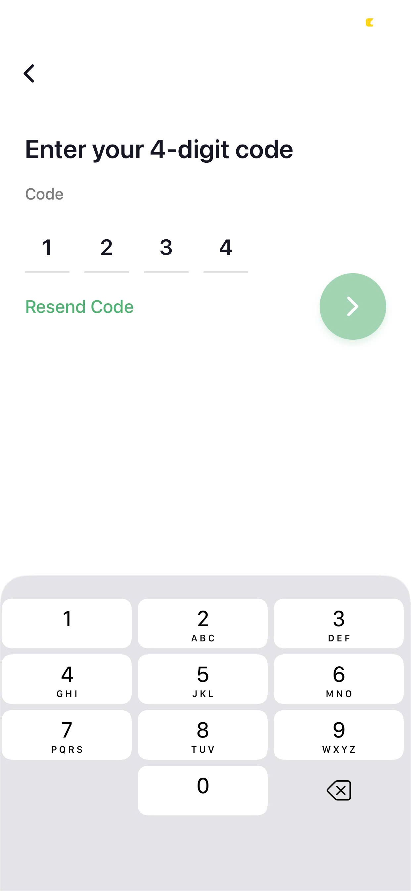
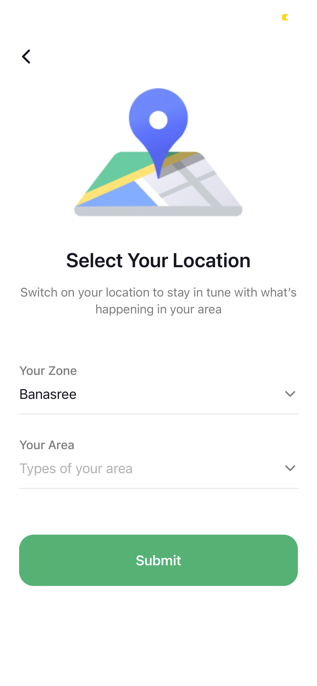
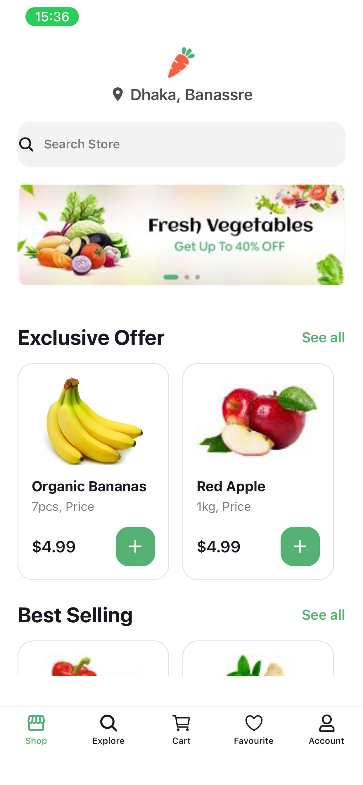
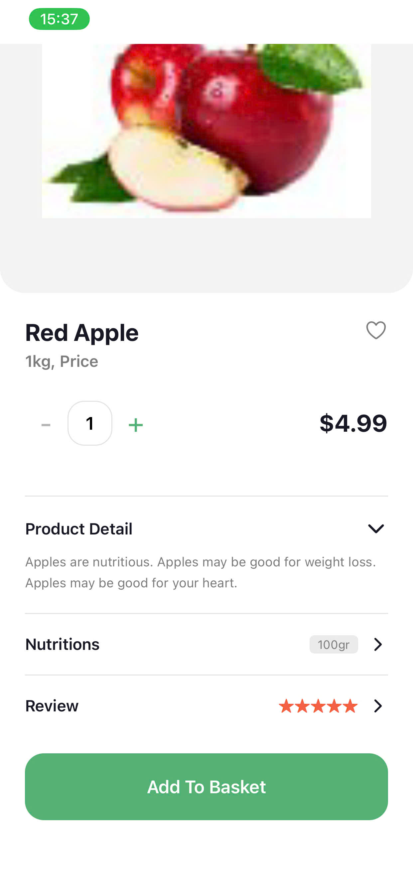
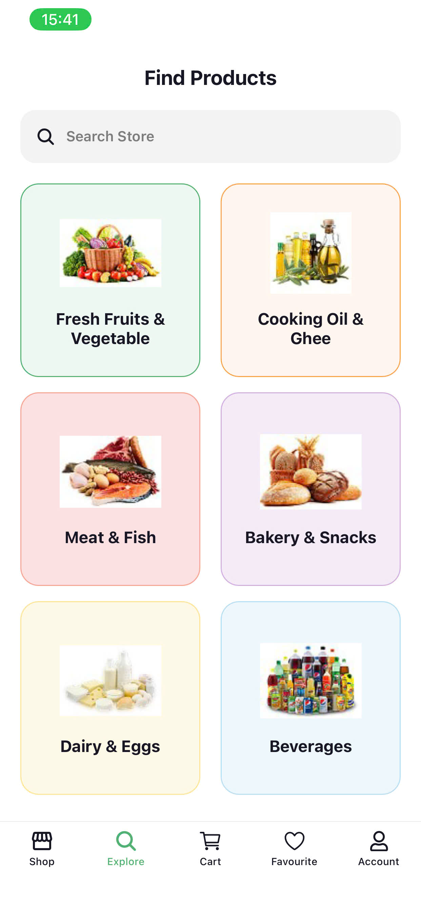
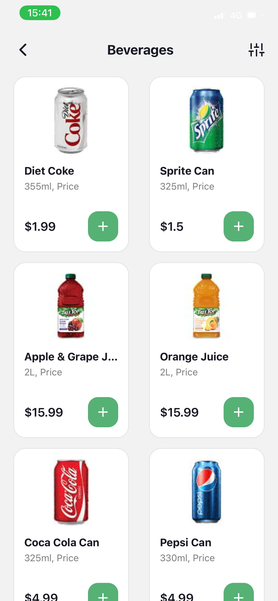

# **TH 11/4 & 17/4 Nectar App**
- Họ và tên: Bùi Đình Hiếu
- MSV: 23810310246
- Lớp: D18CNPM4
  
---
# Hướng dẫn cài đặt và chạy 
1. **Clone dự án về máy:**
   ```bash
   git clone https://github.com/Hueiboi/mobile-nectar-app.git
   ```

2. **Cài đặt các thư viện cần thiết:**
   ```bash
   npm install
   ```

3. Chạy ứng dụng
   - **Khởi động Expo Server:**
      ```bash
      npx expo start
      ```

   - **Kết nối với thiết bị:**
      - **Android:** Mở ứng dụng **Expo Go** trên điện thoại và chọn "Scan QR Code" để quét mã QR hiển thị trên terminal.
      - **iOS:** Mở ứng dụng **Camera** bình thường và quét mã QR, sau đó chọn mở bằng **Expo Go**.

---

# Screenshots
| Splash Screen | Onboarding | Sign In | Number Input |
| :---: | :---: | :---: | :---: |
|  |  |  |  |

| Verification | Select Location | Login | Sign Up |
| :---: | :---: | :---: | :---: |
|  |  |  |  |

---
| Home | Product Detail | Explore | Beverages |
| :---: | :---: | :---: | :---: |
|  |  |  |  |

---
# Video Demo
- Các thao tác cơ bản

https://github.com/user-attachments/assets/bfbb867c-6a0e-4e8a-ae75-49a41fab7beb


