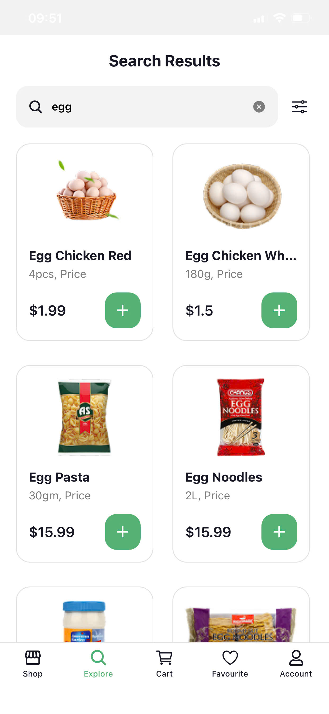
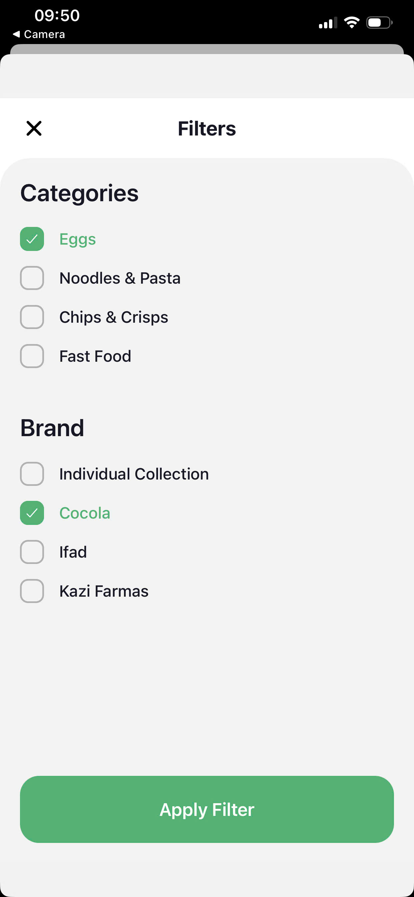
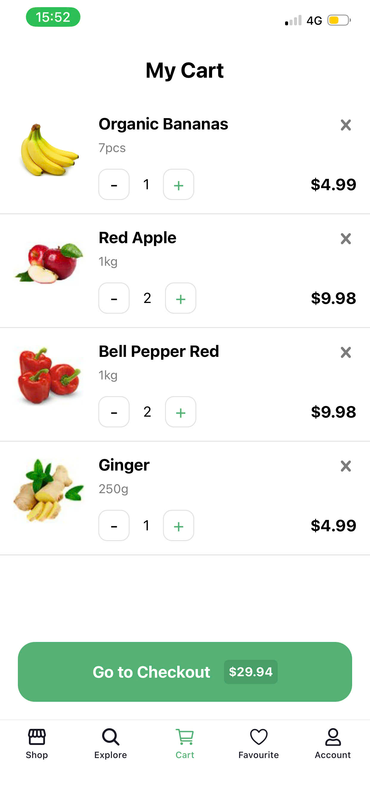
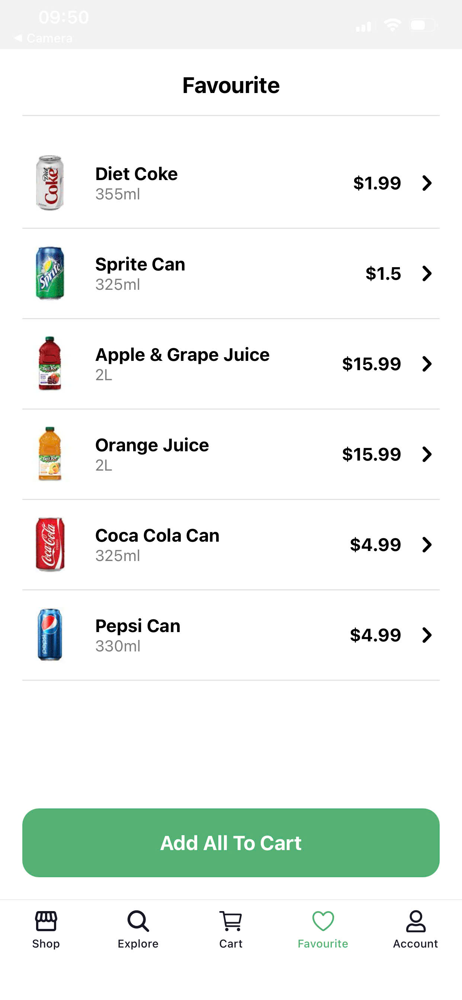
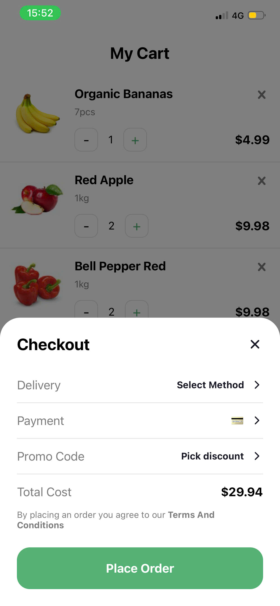
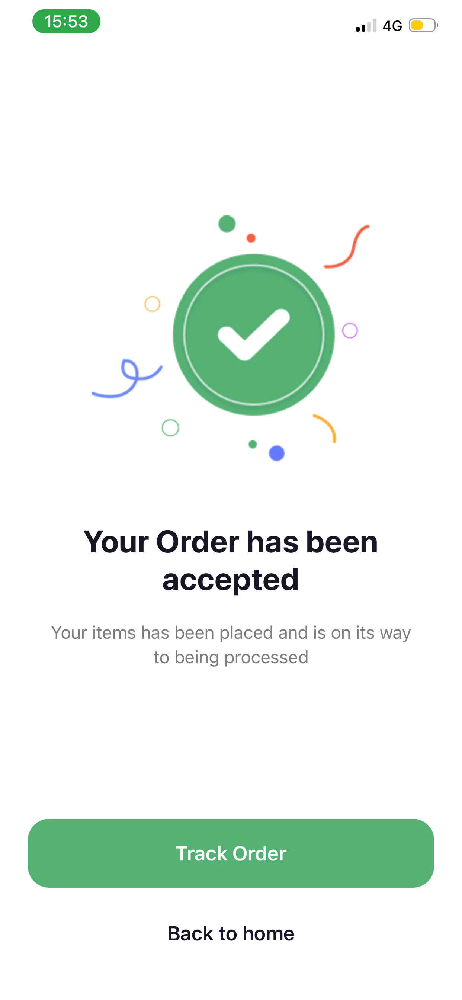
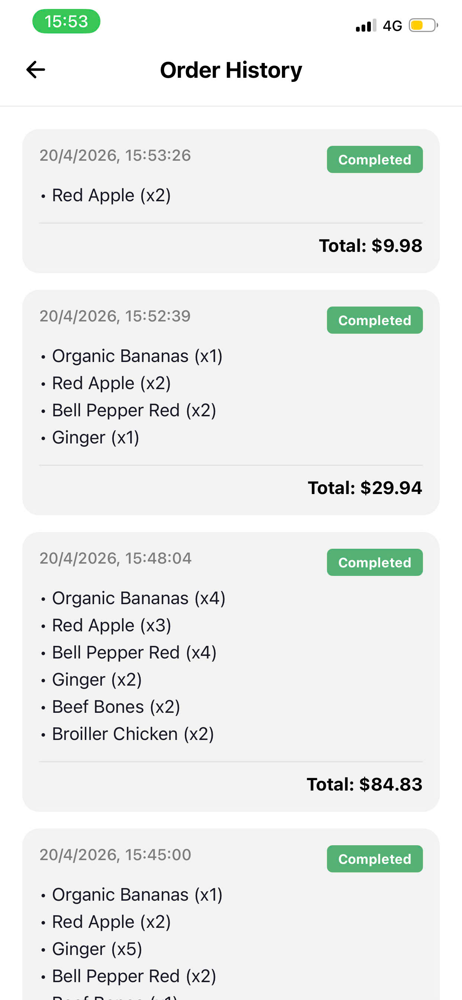
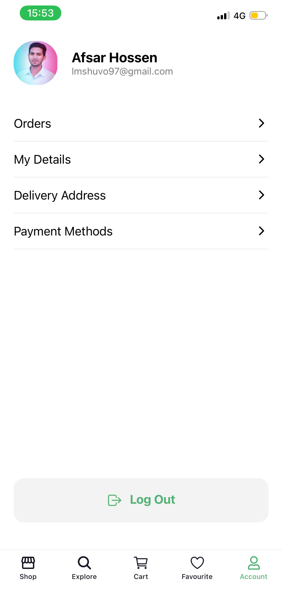

# **TH 11/4, 17/4, 19/4, 20/4 Nectar App**
- Họ và tên: Bùi Đình Hiếu
- MSV: 23810310246
- Lớp: D18CNPM4

---
# Hướng dẫn cài đặt và chạy 
1. **Clone dự án về máy:**
   ```bash
   git clone https://github.com/Hueiboi/mobile-nectar-app.git
   ```

2. **Cài đặt các thư viện:**
   ```bash
   npm install
   ```

3. **Chạy ứng dụng:**
    - **Khởi động Expo Server:**
       ```bash
       npx expo start
       ```
    - **Kết nối với thiết bị:**
       - **Android:** Quét mã QR bằng ứng dụng **Expo Go**.
       - **iOS:** Quét mã QR bằng **Camera**, chọn mở bằng **Expo Go**.

---

# Screenshots
| Splash Screen | Onboarding | Sign In | Number Input |
| :---: | :---: | :---: | :---: |
|  |  |  |  |

| Verification | Select Location | Login | Sign Up |
| :---: | :---: | :---: | :---: |
|  |  |  |  |

---
| Home | Product Detail | Explore | Beverages |
| :---: | :---: | :---: | :---: |
|  |  |  |  |

---

| Search | Filter | Cart | Favourite |
| :---: | :---: | :---: | :---: |
|  |  |  |  |

---

| Cart Checkout | Order Accepted | Order History | Account |
| :---: | :---: | :---: | :---: |
|  |  |  |  |

---

# Video Demo

<details>
<summary><b> Xem Video Demo (Các thao tác cơ bản)</b></summary>

### Video 1
[./assets/video1.mp4](./assets/video1.mp4)
https://github.com/user-attachments/assets/bfbb867c-6a0e-4e8a-ae75-49a41fab7beb

### Video 2
[./assets/video2.mp4](./assets/video2.mp4)

</details>

---

